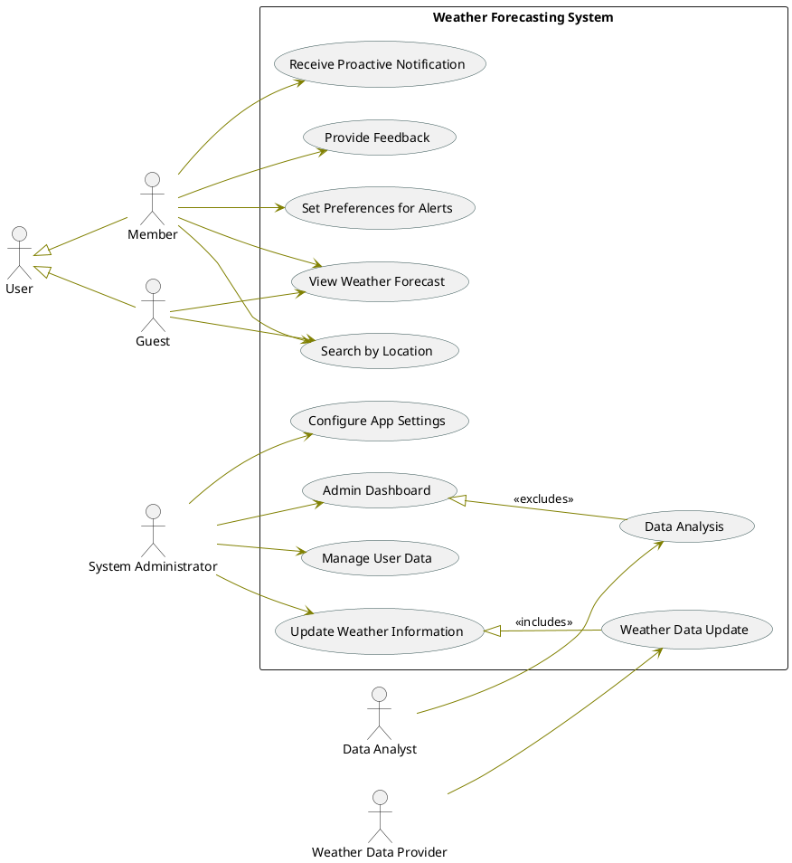

# Software Design and Architecture

## Final project 4th Semester

## 1. Weather Forcasting Class Diagram

**Class Diagram** for a **Weather Forecasting System**. It's a visual representation of the system's functionalities and how different `Classes` interact with these functionalities. Here's a detailed explanation:

1. **Admin Class**:

   - **Attributes**:
     - `Name: String` - The name of the admin.
     - `Address: String` - The physical address of the admin.
     - `Contact_number: long integer` - The contact number for the admin.
   - **Methods**:
     - `Login()` - Allows the admin to log in to the system.
     - `getWeatherForecast()` - Retrieves the latest weather forecast.
     - `getFeedbacks()` - Collects feedback from users.
     - `uploadWeatherData()` - Uploads new weather data to the system.
     - `verifyImage()` - Checks the authenticity or quality of an image.
     - `deleteAccounts()` - Removes user accounts from the system.

2. **Member Class**:

   - **Attributes**:
     - `Name: String` - The name of the member.
     - `Address: String` - The physical address of the member.
     - `Email: String` - The email address of the member.
     - `Password: String` - The password for the member's account.
   - **Methods**:
     - `Login()` - Allows the member to log in to the system.
     - `getWeatherForecast()` - Retrieves the latest weather forecast for the member.
     - `getWarningAlerts()` - Receives warning alerts related to weather conditions.

3. **Guest Class**:

   - **Attributes**:
     - `Guestid: Integer` - A unique identifier for the guest.
   - **Methods**:
     - `Register()` - Allows a new guest to register in the system.
     - `GetWeatherForecast()` - Provides weather forecasts to the guest.
     - `GiveFeedbacks()` - Enables the guest to provide feedback on the service.

4. **Feedback Class**:

   - **Attributes**:
     - `Description: String` - A description of the feedback.
     - `FeedbackStars: Integer` - A star rating associated with the feedback.
   - **Methods**:
     - `ReturnFeedback()` - Returns the feedback received.
     - `CountPositiveFeedback()` - Counts the number of positive feedback entries.
     - `CountNegativeFeedback()` - Counts the number of negative feedback entries.
     - `CalculateFeedbackRate()` - Calculates the overall feedback rate based on entries.

5. **Images Class**:

   - **Attributes**:
     - `Title: String` - The title of the image.
     - `ImageLocation: String` - The storage location of the image.
   - **Methods**:
     - `UploadImages()` - Allows uploading of images to the system.

6. **Verified Image Object**:

   - **Attributes**:
     - `ImageID: Integer` - A unique identifier for the verified image.
   - **Methods**:
     - `CheckPhotoQuality()` - Assesses the quality of the photo.

7. **Non-Verified Image Object**:

   - **Methods**:
     - `ReturnImages()` - Return Unverified photo.

8. **Weather Updates Class**:

   - **Attributes**:
     - `City: String` - The city for which the weather update is applicable.
     - `ZIP: Integer` - The ZIP code of the city.
     - `Date: Date` - The date of the weather update.
   - **Methods**:
     - `ReturnWeatherUpdates()` - Provides the latest weather updates.

9. **Weather Forecast Class**:

   - **Attributes**:
     - `Region: String` - The region for which the forecast is provided.
     - `ZIP: Integer` - The ZIP code of the region.
     - `City: String` - The city within the region.
   - **Methods**:
     - `returnForecast()` - Returns the weather forecast for the specified region.
     - `CreateGraphs()` - Generates graphical representations of the weather forecast.

10. **Warning Alerts Class**:

    - **Attributes**:
      - `Description: String` - A description of the warning alert.
    - **Methods**:
      - `ReturnWarningAlerts()` - Provides warning alerts.
      - `LocateThePlace()` - Identifies the location related to the warning alert.

11. **Weather Station Class**:
    - **Attributes**:
      - `City: String` - The city where the weather station is located.
      - `ZIP: Integer` - The ZIP code of the city.
    - **Methods**:
      - `ReturnWeatherData()` - Returns data collected by the weather station.
      - `ConnectAllStations()` - Connects all weather stations in the network.
      - `ViewTheMap()` - Displays a map of all weather stations.

### Here is the Editable Diagram:

[Class Diagram Editable Link](https://app.creately.com/d/EPYD56GY3TV/edit)

## 2. Weather Forcasting UseCase Diagram

**Use Case Diagram** for a **Weather Forecasting System**. It's a visual representation of the system's functionalities and how different `users` interact with these functionalities. Here's a detailed explanation:

### Actors and Their Use Cases:

- **User**: A registered member who can:

  - **Receive Proactive Notification**: Get alerts without requesting them actively.
  - **Provide Feedback**: Send comments or reports about the system.
  - **Set Preferences for Alerts**: Customize alert settings according to personal preferences.
  - **Search by Location**: Look up weather forecasts for specific places.
  - **View Weather Forecast**: See the weather predictions provided by the system.

- **Guest**: A non-registered user with limited access, who can only:

  - **View Weather Forecast**: Check the weather predictions without the need to log in.

- **System Administrator**: A user with administrative privileges who can:

  - **Configure App Settings**: Adjust the system's operational settings.
  - **Admin Dashboard Access**: Use the dashboard for monitoring and managing the system.
  - **Manage User Data** (excluded use case): Handle users' personal data, likely a restricted action not performed under normal circumstances.

- **Weather Data Provider**: An external entity or service that:
  - **Provide Weather Data**: Supplies the weather data that the system uses to generate forecasts.

### Relationships:

- **"includes" Relationship**: The **Data Analysis** use case includes **Weather Data Update**, meaning updating the weather data is a part of the data analysis process.
- **"excludes" Relationship**: The **Manage User Data** use case is excluded from the regular tasks of the System Administrator, indicating it's an exceptional action.

### Here is the diagram plantuml syntax:

[Usecase Diagram Editable Link](https://online.visual-paradigm.com/app/diagrams/#diagram:proj=0&external=https://cdn-us-04.visual-paradigm.com/node/on/w/orwsgyxc/rest/diagrams/shares/diagram/52fb458a-889d-45aa-baca-e16e880b1719/content&name=Use%20case%20diagram%20for%20weather)
