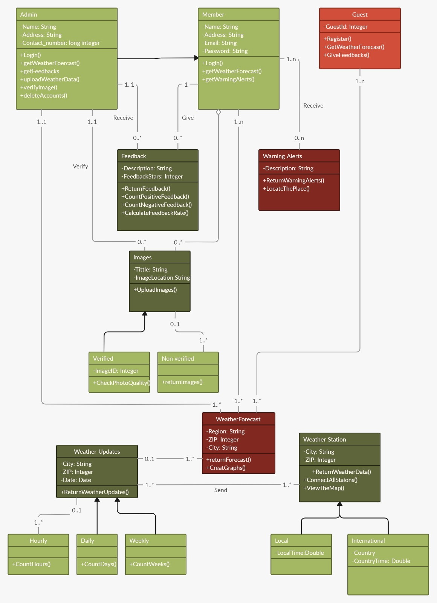
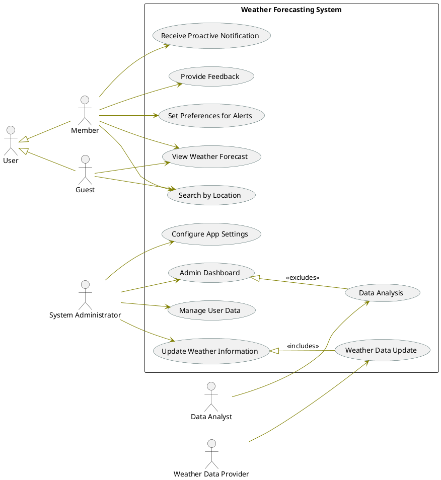

# Weather Forecasting System

## Overview

This project involves designing a Weather Forecasting System. The system allows users to view weather forecasts, receive alerts, provide feedback, and more. The system also includes functionalities for administrators to manage data and update weather information.

## Class Diagram

The **Class Diagram** for the Weather Forecasting System illustrates the structure and relationships between different classes in the system. Below is a detailed explanation of each class and its attributes and methods.

### Classes and Their Details

1. **Admin Class**:

   - **Attributes**:
     - `Name: String`
     - `Address: String`
     - `Contact_number: long integer`
   - **Methods**:
     - `Login()`
     - `getWeatherForecast()`
     - `getFeedbacks()`
     - `uploadWeatherData()`
     - `verifyImage()`
     - `deleteAccounts()`

2. **Member Class**:

   - **Attributes**:
     - `Name: String`
     - `Address: String`
     - `Email: String`
     - `Password: String`
   - **Methods**:
     - `Login()`
     - `getWeatherForecast()`
     - `getWarningAlerts()`

3. **Guest Class**:

   - **Attributes**:
     - `Guestid: Integer`
   - **Methods**:
     - `Register()`
     - `GetWeatherForecast()`
     - `GiveFeedbacks()`

4. **Feedback Class**:

   - **Attributes**:
     - `Description: String`
     - `FeedbackStars: Integer`
   - **Methods**:
     - `ReturnFeedback()`
     - `CountPositiveFeedback()`
     - `CountNegativeFeedback()`
     - `CalculateFeedbackRate()`

5. **Images Class**:

   - **Attributes**:
     - `Title: String`
     - `ImageLocation: String`
   - **Methods**:
     - `UploadImages()`

6. **Verified Image Object**:

   - **Attributes**:
     - `ImageID: Integer`
   - **Methods**:
     - `CheckPhotoQuality()`

7. **Non-Verified Image Object**:

   - **Methods**:
     - `ReturnImages()`

8. **Weather Updates Class**:

   - **Attributes**:
     - `City: String`
     - `ZIP: Integer`
     - `Date: Date`
   - **Methods**:
     - `ReturnWeatherUpdates()`

9. **Weather Forecast Class**:

   - **Attributes**:
     - `Region: String`
     - `ZIP: Integer`
     - `City: String`
   - **Methods**:
     - `returnForecast()`
     - `CreateGraphs()`

10. **Warning Alerts Class**:

    - **Attributes**:
      - `Description: String`
    - **Methods**:
      - `ReturnWarningAlerts()`
      - `LocateThePlace()`

11. **Weather Station Class**:
    - **Attributes**:
      - `City: String`
      - `ZIP: Integer`
    - **Methods**:
      - `ReturnWeatherData()`
      - `ConnectAllStations()`
      - `ViewTheMap()`

### Editable Diagram

To view and edit the class diagram, use the following link:
[Class Diagram Editable Link](https://app.creately.com/d/EPYD56GY3TV/edit)

## Use Case Diagram

The **Use Case Diagram** for the Weather Forecasting System shows the different actions that users (actors) can perform within the system.

### Actors and Their Use Cases

- **User**: A registered member who can:

  - Receive Proactive Notification
  - Provide Feedback
  - Set Preferences for Alerts
  - Search by Location
  - View Weather Forecast

- **Guest**: A non-registered user who can:

  - View Weather Forecast

- **System Administrator**: A user with administrative privileges who can:

  - Configure App Settings
  - Access Admin Dashboard
  - Manage User Data (excluded use case)

- **Weather Data Provider**: An external entity that provides weather data for the system.

### Relationships

- **"includes" Relationship**: The **Data Analysis** use case includes **Weather Data Update**.
- **"excludes" Relationship**: The **Manage User Data** use case is excluded from the System Administrator's regular tasks.

### Diagram PlantUML Syntax

## Conclusion

This document outlines the class and use case diagrams for the Weather Forecasting System. These diagrams provide a structured view of the system's architecture, demonstrating the relationships and interactions between different components and users. The provided editable links allow for further refinement and customization of the diagrams as needed.
